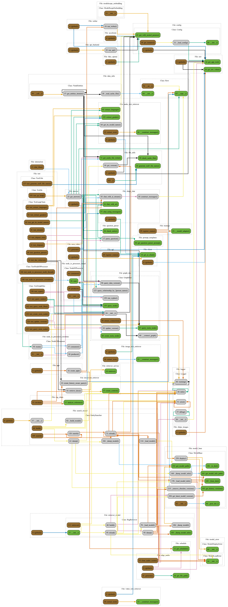

### [遇见李白]

### 1. 项目背景

​       李白 :bust_in_silhouette: 作为唐代杰出诗人，其诗歌作品在中国文学史上具有重要地位。近年来，随着数字技术和人工智能的快速发展，传统文化普及推广的形式也面临着创新与变革。国内外对于李白诗歌的研究虽已相当深入，但在数字化、智能化普及方面仍存在不足。因此，本项目旨在通过构建李白知识图谱，结合大模型训练出专业的AI智能体，以生成式对话应用的形式，推动李白文化的普及与推广。

​       随着人工智能技术的发展，知识图谱技术也得到了广泛的应用。知识图谱是一种基于语言知识库的语义表示模型，它能够将结构化的知识表示为图的形式，从而使得机器能够更好地理解和处理自然语言。
​      在知识图谱技术的基础上，开发一个问答系统可以利用知识图谱中的知识来回答用户的问题。<u>该系统可以利用知识图谱来构建以诗人李白为核心的古诗词文化知识图谱</u> :globe_with_meridians: ，并实现基于该知识图谱的问答功能。另外，对图谱进行可视化探索，以更好地理解知识图谱的结构和内容。同时提供，大模型以及rag检索增强的代码实现。


### 2. 项目目标

2.1 :1st_place_medal: 收集整理李白诗歌及其相关文化资料：通过文献调研、数据挖掘等方法，全面收集李白的诗歌作品、生平事迹、历史背景等相关资料，为构建李白知识图谱提供基础数据。

2.2 :2nd_place_medal: 构建李白知识图谱：利用自然语言处理、信息抽取等技术，对收集到的资料进行整理和分析，构建出一个完整的李白知识图谱。该图谱将涵盖李白的生平、诗歌风格、艺术成就等多个方面，为后续的AI智能体训练提供丰富的知识库。

2.3 :3rd_place_medal: 训练专业的AI智能体：基于构建好的李白知识图谱，利用大模型技术训练出具有专业水平的AI智能体。该智能体将具备对李白诗歌的深入理解和鉴赏能力，能够与用户进行高质量的互动。

2.4 :four:开发生成式对话应用：在训练好的AI智能体基础上，开发一款生成式对话应用。该应用将能够实现与用户的实时互动，为用户提供个性化的李白诗歌鉴赏体验。

### 3. 项目技术栈

- Python

- PyTorch

- Transformers

- fastAPI

- DGL

- DGL-KE

- Neo4j

- AC自动机

- RAG

- langchain

- edge-tts

- modelscope

- gradio

- zhipuai

  

### 4. 项目功能

- 数据预处理：对古诗词数据进行清洗、分词、构建知识图谱

- 知识图谱构建：利用知识图谱技术构建以李白为核心的古诗词文化知识图谱
  - 问答系统构建：利用知识图谱中的知识来回答用户的问题   
    - 图谱可视化：对知识图谱进行可视化探索，以更好地理解知识图谱的结构和内容   
  
- :hotsprings:图谱问答思路：
  
  - :smile_cat:普通流式问答
  
  - :recycle: 关系型问答：
    - 李白和杜甫的关系是什么
    
  - :package:属性问答：
    - 李白生于哪一年
    
  - :gift: 生成语音、图像：
    - 请生成李白在江边喝酒的图片
    
    - 请生成春望这首诗的语音
    
      

### 5. 项目现状

- 构建了一个基于知识图谱的问答系统，该系统能够利用知识图谱中的知识来回答用户的问题。     
- 对图谱进行可视化探索，以更好地理解知识图谱的结构和内容。
- 提供大模型以及rag检索增强的代码实现。

### 6. 项目挑战

- 知识图谱的构建和维护
- 问答系统的实现和优化
- 图谱的可视化探索
- 大模型以及rag检索增强的代码实现

### 7. 项目展望

- 进一步优化问答系统的回答质量和效率
- 探索其他类型的问答任务，如常识 问题、知识推理等
- 持续更新和维护知识图谱，以保持其准确性、完整性和有效性

### 8. 项目技术架构

通过本项目的实施，我们不仅实现了基于知识图谱的问答系统，还积累了丰富的实践经验和知识图谱技术应用经验。在未来的工作中，我们将不断优化问答系统的回答质量和效率，并探索其他类型的问答任务，以满足更多用户的需求。同时，我们将继续更新和维护知识图谱，以保持其准确性、完整性和有效性，为知识图谱技术的发展和应用做出贡献 。以下是项目技术架构图：


### 9. 项目代码结构



### 10. 核心函数


## 底层主要依赖

- [Transformers](https://huggingface.co/transformers/index.html)
- [FastAPI](https://fastapi.tiangolo.com/)
- [PyTorch](https://pytorch.org/)
- [Gradio](https://gradio.app/)

## 如何启动项目

#### 1. 配置第三方大模型api key

​	:key:使用[智普ai](https://open.bigmodel.cn/)开放平台，请跳转到该平台，申请api key。然后，将api key填入`.env`文件中。

#### 2. 创建python环境（>=python3.10）

- 使用conda来管理python环境，所以请先安装conda ([Install Conda](https://conda.io/projects/conda/en/latest/user-guide/install/index.html)):smile_cat:

- 使用conda命令来创建python环境

  ```bash
  #Create a new environment: Use the following command to create a new Python environment with a specific vesion.(当然国内你可能需要配置conda和pip镜像)
  
  conda create --name myenv python=3.10
  
  #This will create a new environment named myenv with the specified Python version.
  #Activate the environment: Once the environment is created, you need to activate it. 
  
  conda activate myenv
  
  ```

- 安装依赖包

  ```bash
  pip install -r requirements.txt
  ```

#### 3. 建立图数据库

- ##### 请根据以下指引，安装neo4j

[使用docker安装neo4j]: https://hub.docker.com/_/neo4j


> You can start a Neo4j container like this:
>
> ```console
> docker run \
>     --publish=7474:7474 --publish=7687:7687 \
>     --volume=$HOME/neo4j/data:/data \
>     neo4j
> ```
>
> which allows you to access neo4j through your browser at [http://localhost:7474](http://localhost:7474/).
>
> This binds two ports (`7474` and `7687`) for HTTP and Bolt access to the Neo4j API. A volume is bound to `/data` to allow the database to be persisted outside the container.
>
> By default, this requires you to login with `neo4j/neo4j` and change the password. You can, for development purposes, disable authentication by passing `--env=NEO4J_AUTH=none` to docker run.

- ##### 将数据导入neo4j     :smiling_imp:

*注：由于数据的建立和规整涉及版权，本项目不提供完整李白的数据，只提供示例数据*

`Cypher query` 语句如下：

```cypher
# 创建`李白`节点
CREATE (p:`人物`:`唐`: {name: '李白', PersonId:32540})

# 创建‘高力士’节点
CREATE (p:`人物`:`唐`: {name: '高力士', PersonId:32541})
                      
# 创建李白和高力士的关系
MATCH (a:`人物`:`唐` {PersonId: 32540}), (b:`人物`:`唐` {PersonId: 32541})
CREATE (a)-[r:`李白得罪高力士` {since: 2022, strength: 'strong', Notes: '《李太白全集》卷三五《李太白年譜》：天寶三載，甲申。（五月改"年"爲"載"。四十四歲）太白在翰林，代草王言。然性嗜酒，多沉飮，有時召令撰述，方在醉中，不可待，左右以水沃面，稍解，卽令秉筆，頃之而成。帝甚才之，數侍宴飮。因沉醉引足令高力士脫靴，力士恥之，因摘其詩句以激太眞妃。帝三欲官白，妃輒沮之。又爲張垍讒譖，公自知不爲親近所容，懇求還山，帝乃賜金放歸。又引《松窗錄》：會高力士終以脫靴爲深恥，異日，太眞妃重吟前詞，力士戲曰："比以妃子怨李白深入骨髓，何反拳拳如是？"太眞妃驚曰："何翰林學士能辱人如斯！"力士曰："以飛燕指妃子，是賤之甚矣！"太眞妃深然之。上嘗三欲命李白官，卒爲宮中所捍而止。'}]->(b)
RETURN r
```

#### 4. 配置文件

有3个配置文件：

`部署环境配置./config/config-deploy.yaml`
`测试环境配置./config/config-dev.yaml`
`本地开发配置./config/config-local.yaml`

在`.env`文件中指定启用哪个配置，下面给出一个完整的`.env`内容

```bash
#PY_ENVIRONMENT=dev
PY_ENVIRONMENT=local # 启用本地开发环境
#PY_ENVIRONMENT=deploy
PY_DEBUG=true
ZHIPUAI_API_KEY=
#OPENAI_API_KEY=
```

#### 5. 白话文搜古文、古文搜古文

:smiley:由于涉及到内存问题，这个两个服务独立部署。目前暂不开源，感兴趣的读者，可以自己独立开发。


#### 6. 程序启动

启动shell脚本为`restart.sh`

```bash
> chmod +x ./restart.sh
> ./restart.sh
```

